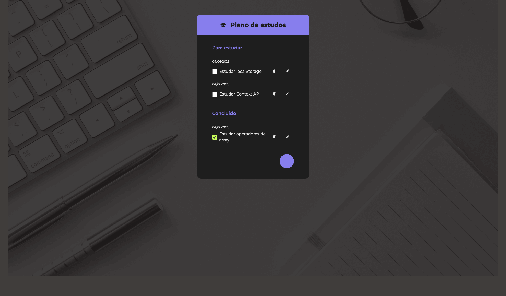

# Study Checklist App

This is a hands-on project I built step-by-step to improve my ReactJS skills and learn how to create more organized, scalable applications with a modern user experience. The app is a checklist tool designed to help manage studies, tasks, or anything else you want to keep track of.

## 🔨 Features

* Add, edit, and delete tasks
* Organize tasks into “To Study” and “Completed” groups
* Mark tasks as completed
* Visual feedback for empty lists (empty state)
* Modal window for adding and editing tasks
* Animated task list

## ✔️ Techniques and Technologies Used

While building this app, I practiced and applied several modern frontend techniques and tools, including:

* **useState and useEffect**: State management and data persistence with `localStorage`
* **useContext**: Global context to share task state across components
* **Component-based architecture**: Reusable components like Button, FabButton, Dialog, TodoForm, TodoItem, and TodoGroup
* **Styling with CSS Modules**: Style encapsulation and organization by component
* **Controlled form handling**
* **Persistent storage with localStorage**: Keeps tasks saved even after closing the app
* **Custom SVG icons**
* **Clean and maintainable code structure**